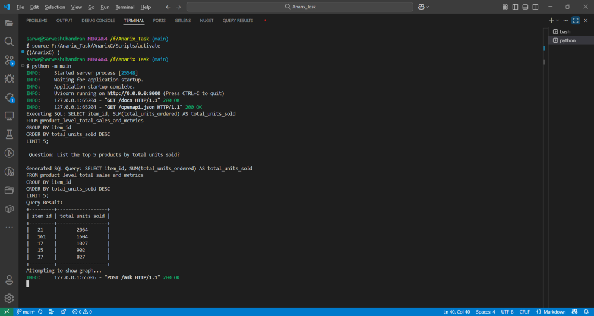
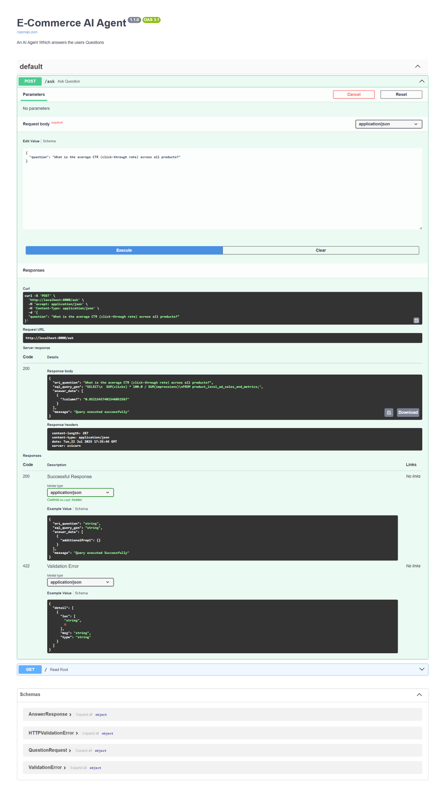
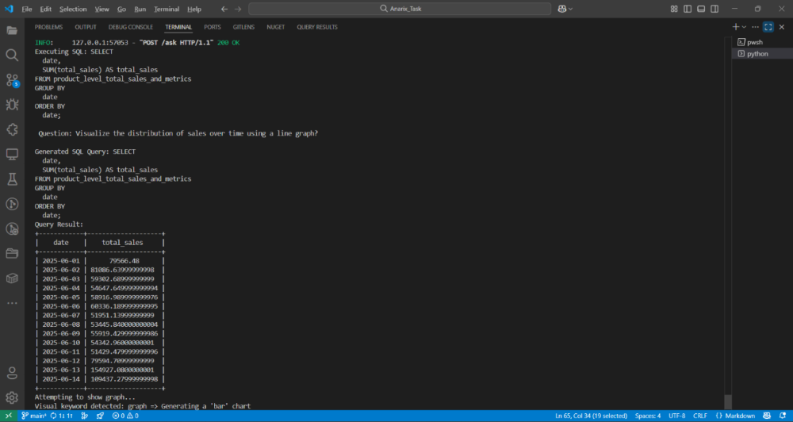

## Anarix AI Agent Task

This project is the Challenge Provided by the Anarix to create a AI-powered E-Commerce data assistant that:

    - Understands the Natural Language Questions
    - Converets them to the any Database Query (I have selected the PostgreSQL) using the LLM (gemini-2.5-flash)
    - Returns the tabulated response in the terminal using the tabulate library
    - Visualizes the results as charts, bars when applicable

---
## Project Directory Structure

```
Anarix_Task/
|__ .env
|__ data/
|   |__ Product-Level Ad Sales and Metrics.csv
|   |__ Product-Level Eligibility Table.csv
|   |__ Product-Level Total Sales and Metrics.csv
|__ db/
|   |__connection.py
|   |__ queries.py
|
|__ llm/
|   |__ agent.py
|
|__ init_db.py
|__ requirements.py
|__ TASK DESCRIPTION_GenAI Intern VIT.pdf
|__ README.md
```
---

## Set UP Instructions

## 1. Add the Environment for your Database (postgres) DB_URL and the Gemini_API_KEY

``` .env
API_KEY = your_gemini_api_key
You can Collect you API_KEY from here : https://aistudio.google.com/apikey
DB_URL = postgresql://<username>:<your-db-password>@localhost:5432/<your_db>
```

### 2. Create and Activate Python Virtual Environment, Then Install Dependencies

```bash
# Create virtual environment
python -m venv <your-venv-name>
```

#### Activate on PowerShell (Windows):
```powershell
.\<your-venv-name>\Scripts\activate
```

#### Activate on Linux / Git Bash:
```bash
source <your-venv-name>/Scripts/activate
```

#### Install project dependencies:
```bash
pip install -r requirements.txt
```


## 3. Load the csv files to your PostgreSQL
``` bash
python init_db.py or python -m init_db
```

## 4. Run the AI Agent by Running the main.py
``` bash
python main.py or python -m main
The output runs in the following server: http://127.0.0.1:8000/docs or http://localhost:8000/docs
```
---
### Screenshots
### 1. Terminal Interaction

---
---
### 2. Swagger UI (/docs)


---
---
### 3. Auto-Generated Line Chart
#### Query Asked:

#### Result:


---
### 4. Auto-Generated Bar Chart
#### Query Asked:

#### Result:

---
